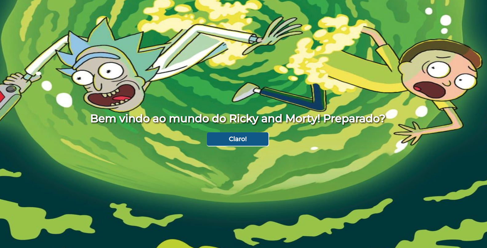

### Desafio Azship



O projeto é uma aplicação front-end onde consumo a api do Ricky and Morty para renderizar os episódios e detalhes de cada um, podendo também adicionar como episódio favorito e visto.

## 🛠️ Tecnologias utilizadas

- [JavaScript](https://developer.mozilla.org/en-US/docs/Web/JavaScript/Language_Resources)
- [React](https://pt-br.reactjs.org/)
- [React-router-dom] (https://v5.reactrouter.com/web/guides/quick-start)
- [Styled-Components] (https://www.npmjs.com/package/styled-components)

## 🚀 Clonando o projeto

Abra seu terminal e digite os seguintes comandos:
```
git clone git@github.com:rodolfoserralha/desafio-azship.git

cd desafio-azship
```

## 🚀 Iniciando a Aplicação
Com o projeto clonado em sua máquina, no diretório do projeto, basta rodar

```
npm install
```
Aguarde a instalação das dependências e depois rode o comando

```
npm start
```

Prontinho, sua aplicação está rodando!
